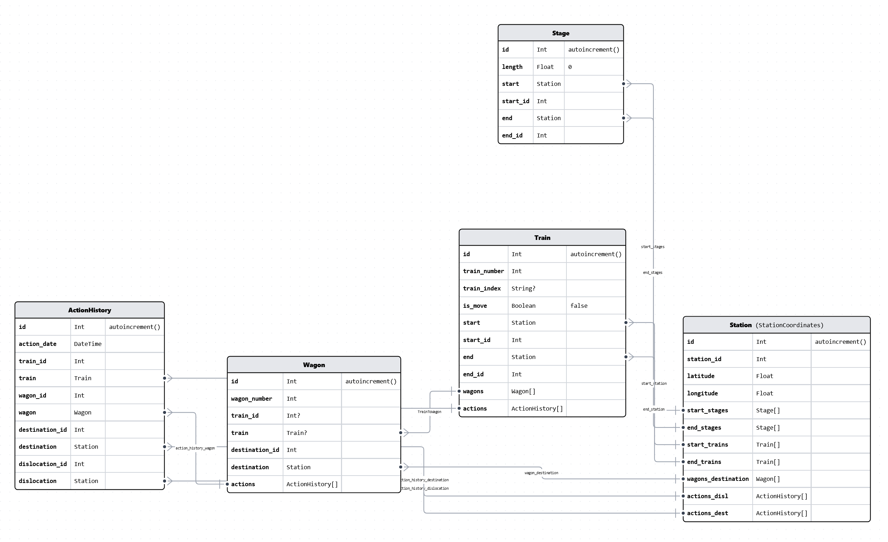

# Prerequisites

1.  **Install Docker:** If you don't already have Docker installed, you can download and install it from the official Docker website based on your operating system:
    
    -   [Docker for Windows](https://docs.docker.com/desktop/install/windows-install/)
    -   [Docker for macOS](https://docs.docker.com/desktop/install/mac-install/)
    -   [Docker for Linux](https://docs.docker.com/desktop/install/linux-install/)
2.  **Install Docker Compose:** Docker Compose is usually included with Docker Desktop on Windows and macOS. For Linux users, you might need to install Docker Compose separately. You can find installation instructions in the [Docker Compose documentation](https://docs.docker.com/compose/install/).
    
3.  **Ensure Prerequisites:**
    
    -   Make sure that you have the required project directory structure in place with the `backend` and `frontend` subdirectories and any necessary code.
    -   Ensure that you have a PostgreSQL initialization script in the `./InitDatabase` directory, as the Docker Compose file references it to initialize the database.
4.  **Build and Run the Docker Compose Configuration:**
    
    -   Navigate to the directory containing your `docker-compose.yml` file.
        
    -   Open a terminal or command prompt.
        
    -   Run the following command to start the services defined in the Docker Compose file:
        
        shellCopy code
        
        `docker-compose up`         
    
    This command will build and run the containers as defined in the `docker-compose.yml` file.
    
5.  **Access the Services:**
    
    -   Once the services are up and running, you should be able to access the backend API at `http://localhost:3030` and the frontend at `http://localhost:5173`, PostgreSQL at `http://localhost:5432`.

# DB

## Database Schema

# REST
## PING Endpoint

-   **Endpoint:** `/v1/ping`
-   **HTTP Method:** GET
-   **Description:** This endpoint is used to ping the server and get a "pong" response along with the current server time.

## Station Endpoints

### Get Station by ID

-   **Endpoint:** `/v1/station/id/:id`
-   **HTTP Method:** GET
-   **Description:** Retrieve information about a station by its ID.

### Get All Stations

-   **Endpoint:** `/v1/station/all`
-   **HTTP Method:** GET
-   **Description:** Retrieve a list of all available stations.

## Train Endpoints

### Get All Trains

-   **Endpoint:** `/v1/train/all`
-   **HTTP Method:** GET
-   **Description:** Retrieve a list of all available trains.

### Get Trains by Time

-   **Endpoint:** `/v1/train/all/:time`
-   **HTTP Method:** GET
-   **Description:** Retrieve a list of trains based on a specified time.

### Get Train by ID (Short)

-   **Endpoint:** `/v1/train/short/:id/:time`
-   **HTTP Method:** GET
-   **Description:** Retrieve information about a specific train by its ID and time.

### Get State of a Moving Train

-   **Endpoint:** `/v1/train/is_moving/:id`
-   **HTTP Method:** GET
-   **Description:** Check the state of a moving train using its ID.

### Get Last Station Time for a Train

-   **Endpoint:** `/v1/train/last_station_time/:id`
-   **HTTP Method:** GET
-   **Description:** Retrieve the time of the last station for a specific train.

### Get Train by ID (Full)

-   **Endpoint:** `/v1/train/full/:id/:time`
-   **HTTP Method:** GET
-   **Description:** Retrieve detailed information about a specific train by its ID and time.

### Get Full Path Info for a Train

-   **Endpoint:** `/v1/train/path/full/:id/:time`
-   **HTTP Method:** GET
-   **Description:** Retrieve the full path information for a specific train.

## Import Endpoints

### Import Station Data

-   **Endpoint:** `/v1/import/station/:filename`
-   **HTTP Method:** POST
-   **Description:** Import station data from a specified file.

### Import Stage Data

-   **Endpoint:** `/v1/import/stage/:filename`
-   **HTTP Method:** POST
-   **Description:** Import stage data from a specified file.

### Import Wagon Data

-   **Endpoint:** `/v1/import/wagon/:filename`
-   **HTTP Method:** POST
-   **Description:** Import wagon data from a specified file.

### Import Train Data

-   **Endpoint:** `/v1/import/train/:filename`
-   **HTTP Method:** POST
-   **Description:** Import train data from a specified file.

## Delete Endpoint

### Delete Database Table

-   **Endpoint:** `/v1/delete/db_table/:table`
-   **HTTP Method:** DELETE
-   **Description:** Delete a specific database table by its name.